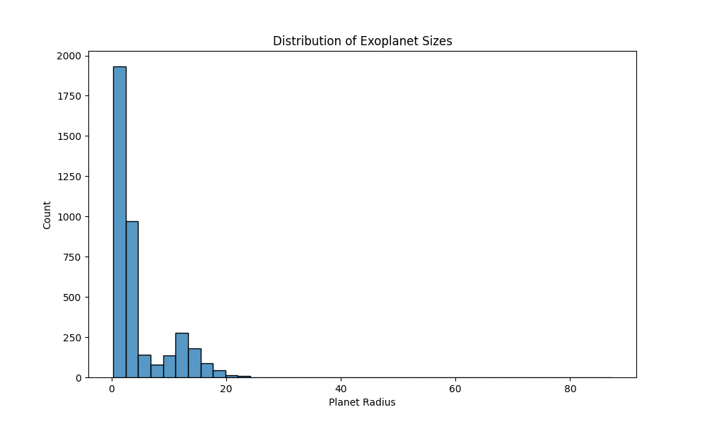
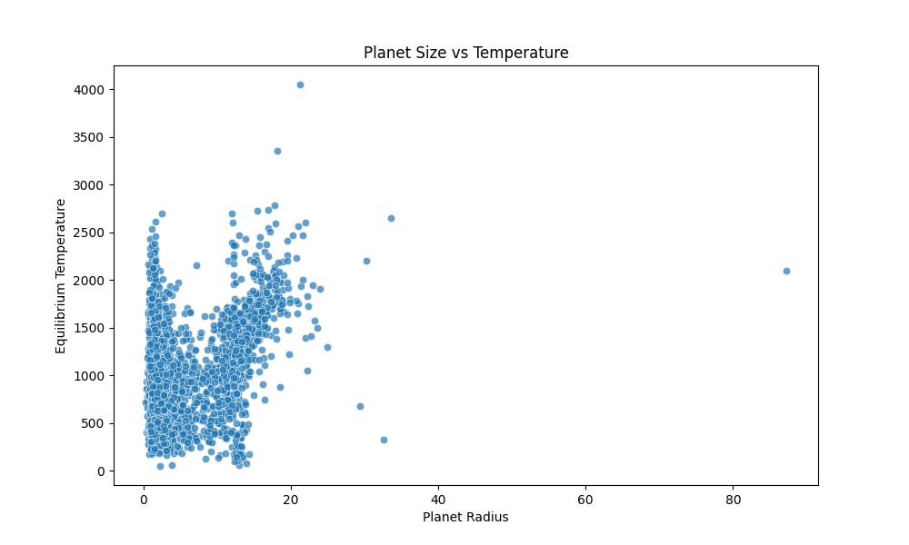
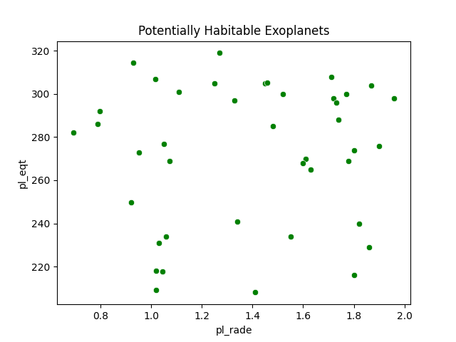
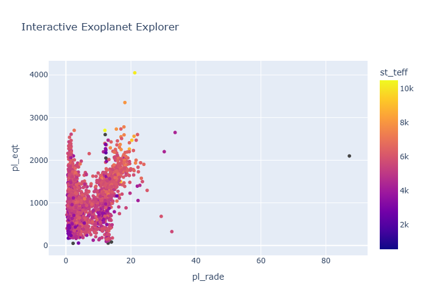
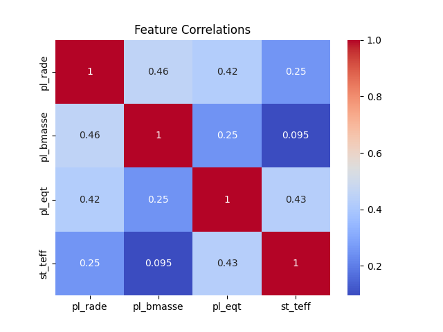

# NASA Exoplanet Data Analysis

## Project Overview

This project analyzes real exoplanet data from NASA's Exoplanet Archive using Python and Jupyter Notebook.

The goal of this project is to explore relationships between planetary size, temperature, host stars, and potentially habitable planets through data visualization and exploratory data analysis.

## Tools Used

- pandas
- numpy
- matplotlib
- seaborn
- plotly
- kaleido
- jupyterlab

## Dataset Informaion

Data was obtained from NASA's Exoplanet Archive:

https://exoplanetarchive.ipac.caltech.edu/

The dataset was retrieved using NASA's Exoplanet Archive API and includes information about confirmed exoplanets such as:

- Planet radius
- Planet mass
- Equilibrium temperature
- Host star temperature
- Distance from Earth

## Project Structure

nasa-exoplanet-analysis/

- ├──data/
- ├── notebooks/
- ├── images/
- ├── README.md
- └── requirements.txt

## Project Goals

This analysis explores scientific questions, such as:

- Are larger planets generally hotter?
- Which planets may exist in the habitable zone?
- How do host star temperatures affect planets?
- What trends exist among confirmed exoplanets?

## Data Visualizations

### Distribution of Exoplanet Sizes

### Planet Size vs Temperature

### Potentially Habitable Planets

### Interactive Exoplanet Explorer

>Click to open interactive version: [Open Interactive Exoplanet Explorer](https://htmlpreview.github.io/?https://github.com/YOUR_USERNAME/YOUR_REPO_NAME/blob/main/images/interactive_exoplanet.html)

### Feature Correlations

## Key Findings

- Most confirmed exoplanets are larger than Earth.
- Extremely hot planets are common in current discoveries.
- Smaller rocky planets appear less frequently in the dataset.
- Several planets fall within approximate habitable-zone temperature ranges.
- Host star temperature appears related to planetary equilibrium temperature.

## How to Run This Project

1. Clone the repository:
   git clone https://github.com/morganm4951-debug/nasa-exoplanet-analysis.git

2. Enter the project folder:
   cd nasa-exoplanet-analysis

3. Install dependencies:
   pip install -r requirements.txt

4. Start JupyterLab:
   jupyter lab

5. Open the notebook:
   notebooks/exoplanet_analysis.ipynb

6. Run all cells:
   Kernel → Restart Kernel and Run All